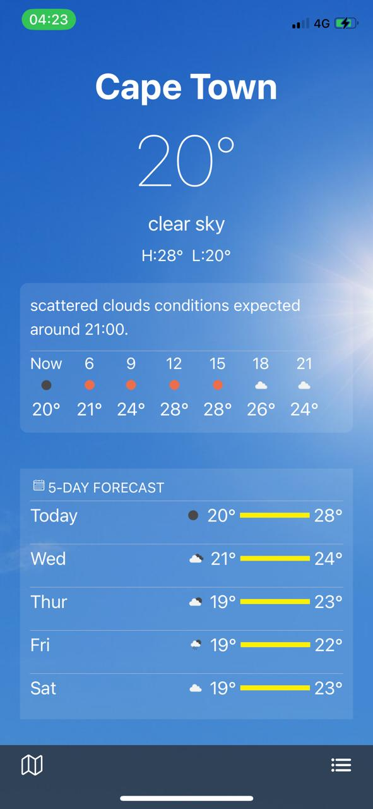
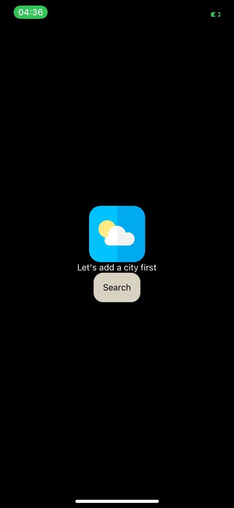

# Weather Forecast App

## Introduction
The Weather Forecast App is an iOS application that provides users with real-time weather updates and forecasts. This app leverages weather APIs to fetch current weather conditions, hourly forecasts, and weekly forecasts for any location.

Specificaly this version can also run on Android since it is crossplatform version build with react native.

## Features
- **Current Weather**: Displays the current temperature, weather conditions, humidity, and wind speed.
- **Hourly Forecast**: Provides weather predictions for the next 24 hours.
- **Weekly Forecast**: Shows weather forecasts for the upcoming week.
- **Location Search**: Allows users to search for weather information by city or GPS location.

## Installation
for mac devices or ios
1. Clone the repository:
    ```bash
    git clone https://github.com/yourusername/Weather-Forecast-App.git
    ```
2. Navigate to the project directory:
    ```bash
    cd Weather-Forecast-App
    ```
3. Install dependencies:
    ```bash
    pod install
    ```
4. Open the project in Xcode:
    ```bash
    open Weather-Forecast-App.xcworkspace
    ```
5. Build and run the app on your iOS device or simulator.

for android devices using windows
1. Clone the repository:
    ```bash or cmd
    git clone https://github.com/yourusername/Weather-Forecast-App.git
    ```
2. Navigate to the project directory:
    ```bash or cmd
    cd Weather-Forecast-App
    ```
3. Install dependencies:
    ```bash or cmd
    npm install
    ```
4. Open the project in vscode:
    ```bash or cmd
    code .
    ```
5. Build and run the app on your Expo Go.

## Usage
1. Launch the app on your Expo Go.
2. Use the search bar to find weather information for different cities.
3. View current weather conditions, hourly forecasts, and weekly forecasts.
4. View weather conditions of areas pinned on a map

## Technologies Used
- **TypeScript**: The primary programming language used for React Native Apps.
- **React Native Paper**: Framework for building the app's user interface (Paper is a collection of customizable and production-ready components for React Native, following Google’s Material Design guidelines).
- **React Native Wind**: Framework for Styling using tailwind css.
- **OpenWeatherMap API**: Api Provider for weather conditions.
- **Axios**: Promise-based HTTP client for API calls.
## Technologies Used
- **TypeScript**: The primary programming language used for React Native Apps.
- **React Native Paper**: Framework for building the app's user interface (Paper is a collection of customizable and production-ready components for React Native, following Google’s Material Design guidelines).
- **React Native Wind**: Framework for Styling using tailwind css.
- **OpenWeatherMap API**: Api Provider for weather conditions.
- **Axios**: Promise-based HTTP client for API calls.
- **React Navigation**: Routing and navigation library.

## Media
### Screenshot
# Weather Forecast App

## Introduction
The Weather Forecast App is an iOS application that provides users with real-time weather updates and forecasts. This app leverages weather APIs to fetch current weather conditions, hourly forecasts, and weekly forecasts for any location.

Specifically, this version can also run on Android since it is a cross-platform version built with React Native.

## Features
- **Current Weather**: Displays the current temperature, weather conditions, humidity, and wind speed.
- **Hourly Forecast**: Provides weather predictions for the next 24 hours.
- **Weekly Forecast**: Shows weather forecasts for the upcoming week.
- **Location Search**: Allows users to search for weather information by city or GPS location.

## Known Issues
    - The app does not currently support switching between Celsius and Fahrenheit. even if the buttons may appear please not they are not functional. The weather conditions are in Celsius on this app.
    
## Installation
for mac devices or ios
1. Clone the repository:
        ```bash
        git clone https://github.com/yourusername/Weather-Forecast-App.git
        ```
2. Navigate to the project directory:
        ```bash
        cd Weather-Forecast-App
        ```
3. Install dependencies:
        ```bash
        pod install
        ```
4. Open the project in Xcode:
        ```bash
        open Weather-Forecast-App.xcworkspace
        ```
5. Build and run the app on your iOS device or simulator.

for android devices using windows
1. Clone the repository:
        ```bash or cmd
        git clone https://github.com/yourusername/Weather-Forecast-App.git
        ```
2. Navigate to the project directory:
        ```bash or cmd
        cd Weather-Forecast-App
        ```
3. Install dependencies:
        ```bash or cmd
        npm install
        ```
4. Open the project in vscode:
        ```bash or cmd
        code .
        ```
5. Build and run the app on your Expo Go.
    cd Weather-Forecast-App
    ```

## Usage
1. Launch the app on your Expo Go.
2. Use the search bar to find weather information for different cities.
3. View current weather conditions, hourly forecasts, and weekly forecasts.
4. View weather conditions of areas pinned on a map

## Technologies Used
- **TypeScript**: The choosen programming language used for React Native Apps(others may use javascript).
- **React Native Paper**: Framework for building the app's user interface (Paper is a collection of customizable and production-ready components for React Native, following Google’s Material Design guidelines).
- **React Native Wind**: Framework for Styling using tailwind css.
- **OpenWeatherMap API**: Api Provider for weather conditions.
- **Axios**: Promise-based HTTP client for API calls.
- **React Navigation**: Routing and navigation library.
- **MobX**: State management library.

## Note
This app requires you to acquire an API key(EXPO_PUBLIC_API_KEY should be defined in your .env file) from OpenWeatherMap in order to compile and run successfully. You can get your a free API key from the [OpenWeatherMap website](https://openweathermap.org/). if neccessary you may contact the developer for guidance to achive one [futurekgaphola@gmail.com](mailto:futurekgaphola@gmail.com).

## Media
### Screenshot




### Demo Video
[](assets/appvideo.mp4)

## Contact
For any questions or feedback, please contact [futurekgaphola@gmail.com](mailto:futurekgaphola@gmail.com).
